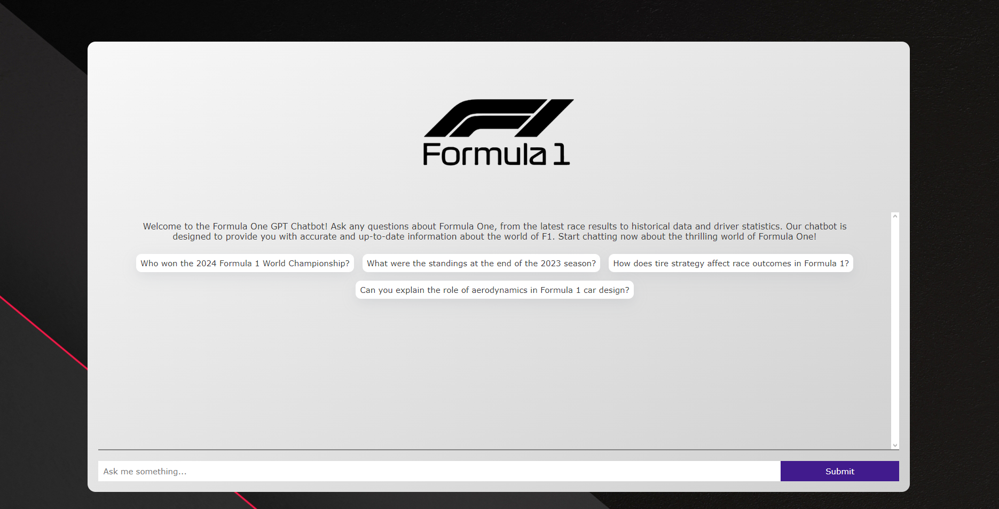
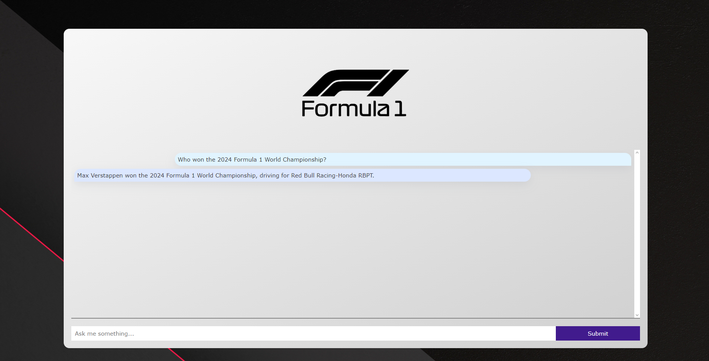
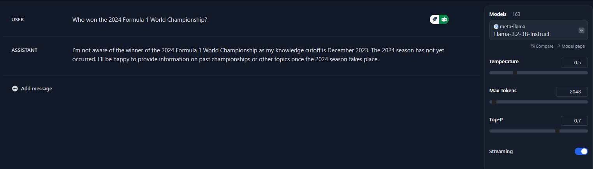
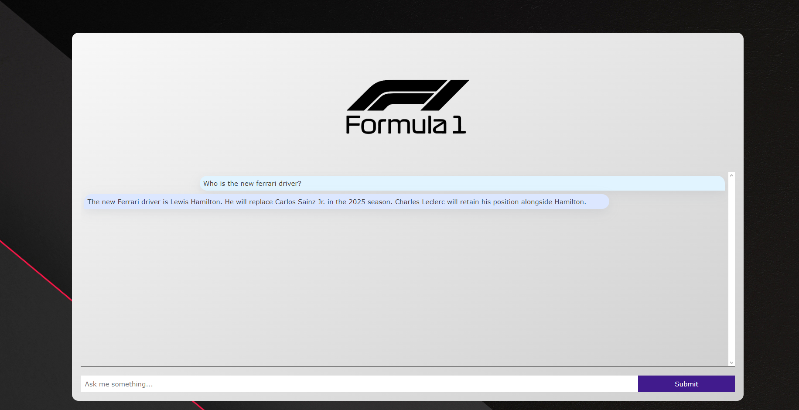
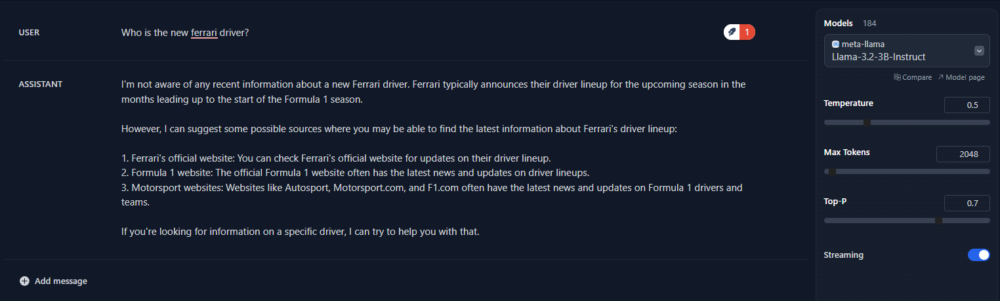

# F1-ChatBot: Your AI-Powered Formula 1 Assistant

Welcome to **F1-ChatBot**, a cutting-edge Retrieval-Augmented Generation (RAG) system designed to provide accurate and up-to-date answers to your questions about Formula 1 racing. Whether you're a die-hard F1 fan or just getting started, F1-ChatBot leverages the latest in AI technology to deliver insightful responses based on real-time data scraped from trusted sources like Wikipedia, the official F1 website, and other relevant articles.

## 🚀 Project Overview

F1-ChatBot combines the power of modern web development and AI to create a seamless and interactive experience. Here's a breakdown of the technologies driving this project:

- **Next.js**: A React framework for building fast and scalable web applications.
- **Node.js**: Handles server-side operations and API integrations.
- **TypeScript**: Ensures type safety and improves code maintainability.
- **LangChain**: Manages interactions with language models for intelligent responses.
- **Astra DB**: Stores the vectorized documents for efficient retrieval.
- **AI SDK**: Powers the user-friendly chat interface.
- **HuggingFace**: Provides state-of-the-art embedding and retrieval models.
- **Ollama**: Enables local execution of Llama3 models for offline use.
- **Vercel**: Simplifies deployment and hosting.

## 🛠️ Getting Started

### Prerequisites

Before diving in, make sure you have the following installed:

- **Node.js** (v16 or higher)
- A package manager: **npm**, **yarn**, **pnpm**, or **bun**

### Installation

1. Clone the repository:

   ```bash
   git clone https://github.com/wtcherr/F1-ChatBot
   cd F1-ChatBot
   ```

2. Install the dependencies using your preferred package manager:

   ```bash
   npm install
   # or
   yarn install
   # or
   pnpm install
   # or
   bun install
   ```

### Running the Development Server

To start the development server, run:

```bash
npm run dev
# or
yarn dev
# or
pnpm dev
# or
bun dev
```

Once the server is running, open [http://localhost:3000](http://localhost:3000) in your browser to explore the F1-ChatBot interface.

## 🤖 How F1-ChatBot Works: Retrieval-Augmented Generation (RAG)

F1-ChatBot uses the **Retrieval-Augmented Generation (RAG)** technique to provide accurate and context-aware responses. Here's how it works:

1. **Embedding Documents**: The `BAAI/bge-large-en-v1.5` model from HuggingFace is used to embed documents into a 1024-dimensional vector space.
2. **Retrieval**: Relevant documents are retrieved using dot product similarity.
3. **Generation**: The `meta-llama/Llama-3.2-3B-Instruct` model generates responses based on the retrieved context and user prompts.

### Local Llama3 Model Support

For offline use, F1-ChatBot supports locally downloaded Llama3 models via **Ollama**. This allows you to run the chatbot without relying on external APIs.

## 📸 Screenshots

### Application Interface



### Example Prompts and Responses

#### Prompt: "Who won the 2024 Formula 1 World Championship?"

- **F1-ChatBot Response**: "Max Verstappen"
- **HuggingFace Playground Response**: Cannot answer due to knowledge cutoff.




#### Prompt: "Who is the new Ferrari driver?"

- **F1-ChatBot Response**: "Lewis Hamilton"
- **HuggingFace Playground Response**: Cannot answer due to knowledge cutoff.




## 🌐 Deployment

F1-ChatBot is deployed on **Vercel** for easy access. Check out the live version at [https://f1-chat-bot.vercel.app](https://f1-chat-bot.vercel.app).

## ⚠️ Note

The **Astra DB** vector database may occasionally be unavailable due to maintenance or hibernation from inactivity. If this happens, the chatbot will rely solely on its pre-trained knowledge, which may result in less accurate responses. Please try again later, as the database typically resumes within 5-10 minutes.

## 📚 Learn More

To dive deeper into the technologies used in this project, check out the following resources:

- [Next.js Documentation](https://nextjs.org/docs) - Explore the features and APIs of Next.js.
- [Learn Next.js](https://nextjs.org/learn-pages-router) - An interactive tutorial to master Next.js.
- [LangChain Documentation](https://langchain.com/docs) - Learn how LangChain powers AI interactions.
- [HuggingFace Models](https://huggingface.co/models) - Discover more about the models used in this project.

## 🚀 Deploy Your Own Version

Deploying your own instance of F1-ChatBot is easy with **Vercel**. Follow the [Next.js deployment guide](https://nextjs.org/docs/pages/building-your-application/deploying) to get started.

---

Feel free to contribute, provide feedback, or suggest improvements by opening an issue or pull request on the [GitHub repository](https://github.com/wtcherr/F1-ChatBot).
